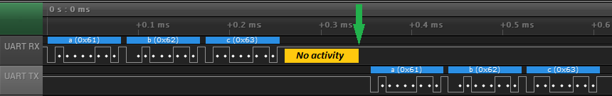

# STM32 UART DMA RX/TX

This is an application note and contains list of examples about `2` distinct topics:
- Receiving data with UART and DMA when application does not know in advance size of bytes to be received
- Transmitting data with UART and DMA to avoid CPU stalling and use CPU for other purposes

## Abbreviations
- DMA: Direct Memory Access controller in STM32
- UART: Universal Asynchronous Receiver Transmitter
- USART: Universal Synchronous Asynchronous Receiver Transmitter
- TX: Transmit
- RX: Receive
- HT: Half-Transfer Complete flag for DMA
- TC: Transfer Complete flag for DMA
- RTO: Receiver Timeout

## General about UART

> STM32 has peripherals such as USART and UART. Difference is that USART also has advance feature such as synchronous communication, not available in UART.
> For the sake of this application note, we will use term **UART**, while exactly same applies to **USART** peripherals too.

UART in STM32 allows customers to configure it using different transmit(`TX`)/receive(`RX`) modes:

- Polling mode (no DMA, no IRQ)
	- Application is polling for status bits to check if any character has been transmitted/received and read it fast enough in order to not-miss any byte
	- P: Easy to implement
	- C: Easy to miss received characters in bursts
	- C: Works only for low baudrates, `9600` or lower
	- C: Application must periodically (with high frequency) check for new characters, usually not always possible at complex systems
- Interrupt mode (no DMA)
	- UART triggers interrupt and CPU jumps to service routine to handle each received byte separately
	- P: Commonly used approach in embedded applications
	- P: Works well with common baudrates, `115200`, up to `~921600` bauds
	- C: Interrupt service routine is executed for every received character
	- C: May stall other tasks in high-performance MCUs if interrupts are triggered for every character
	- C: May stall operating system when receiving burst of data, interrupt priority must be higher than operating system maximum is
- DMA mode
	- DMA is used to transfer data from USART RX data register to user memory on hardware level. No application interaction is needed at this point except processing received data by application once necessary
	- P: Transfer from USART peripheral to memory is done on hardware level without CPU interaction
	- P: Can work very easily with operating systems
	- P: Optimized for highest baudrates `> 1Mbps` and low-power applications
	- P: In case of big bursts of data, increasing data buffer size can improve functionality
	- C: Number of bytes to transfer must be known in advance by DMA hardware
	- C: If communication fails, DMA may not notify application about all bytes transferred

> For RX mode, this article focuses only on *DMA mode*, to receive unknown number of bytes

Every STM32 has at least one (`1`) UART IP and at least one (`1`) DMA controller available in its DNA.
For data transmission, no special features (on top of essential one) are necessary, except DMA availability for UART.
Application uses use default features to implement very efficient transmit system using DMA.

While it is straight-forward for RX, this is not the case for receive operation.
When implementing DMA receive, application would need to understand number of received bytes to process by DMA before finishing transfer.
This is especially true when UART is used for system communication where it has to react in short time after all bytes have been received.
STM32s have capability in UART to detect when *RX* line has not been active for period of time. This is achieved using one of `2` available methods:
- *IDLE LINE event*: Triggered when RX line has been in idle state (normally high state) for `1` frame time, after last received byte. Frame time is based on baudrate. Higher baudrate means lower frame time for single byte.
- *RTO (Receiver Timeout) event*: Triggered when line has been in idle state for programmable time. It is fully configured by firmware.

Both events can trigger an interrupt which is an essential feature to allow effective receive operation

> Not all STM32 have *IDLE LINE* or *RTO* features available. When not available, examples concerning these features may not be used.

An example: To transmit `1` byte at `115200` bauds, it takes approximately (for easier estimation) `~10us`; for `3 bytes` it would be `~30us` in total. IDLE line event triggers an interrupt for application when line has been in idle state for `1` frame time (in this case `10us`) after third byte has been received.



This is a real experiment demo using *STM32F4* and *IDLE LINE* event. After *IDLE event* is triggered, data are echoed back (loopback mode):

- Application receives `3` bytes, takes approx `25us` at `115200` bauds
- *RX* goes to high state (yellow rectangle) and *UART RX* detects that it has been idle for at least `1` frame time (approx `10us`)
	- Width of yellow rectangle represents `1` frame time
- *IDLE line* interrupt is triggered at green arrow
- Application echoes data back from interrupt

## General about DMA

DMA in STM32 can be configured in `normal` or `circular` mode.
For each mode, *DMA* requires number of *elements* to transfer before its events (half-transfer complete, transfer complete) are triggered.

- *Normal mode*: DMA starts with data transfer, once it transfers all elements, it stops and sets enable bit to `0`.
	- Application is using this mode when transmitting data
- *Circular mode*: DMA starts with transfer, once it transfers all elements (as written in corresponding length register), it starts from beginning of memory and transfers more
	- Applicaton is using this mode when receiving data

While transfer is active, `2` (among others) interrupts may be triggered:

- *Half-Transfer complete `HT`*: Triggers when DMA transfers half count of elements
- *Transfer-Complete `TC`*: Triggers when DMA transfers all elements

> When DMA operates in *circular* mode, these interrupts are triggered periodically

> Number of elements to transfer by DMA hardware must be written to relevant DMA register before start of transfer

### Combine UART + DMA for data reception

Now it is time to understand which features to use to receive data with UART and DMA to offload CPU.
As for the sake of this example, we use memory buffer array of `20` bytes. DMA will transfer data received from UART to this buffer.

Listed are steps to begin. Initial assumption is that UART has been initialized prior reaching this step, same for basic DMA setup, the rest:

- Application writes `20` to relevant DMA register for data length
- Application writes memory & peripheral addresses to relevant DMA registers
- Application sets DMA direction to *peripheral-to-memory* mode
- Application puts DMA to *circular* mode. This is to assure DMA does not stop transferring data after it reaches end of memory. Instead, it will roll over and continue with transferring possible more data from UART to memory
- Application enables DMA & UART in reception mode. Receive can not start & DMA will wait UART to receive first character and transmit it to array. This is done for every received byte
- Application is notified by DMA `HT` event (or interrupt) after first `10` have been transferred from UART to memory
- Application is notified by DMA `TC` event (or interrupt) after `20` bytes are transferred from UART to memory
- Application is notified by UART IDLE line (or RTO) in case of IDLE line or timeout detected on RX line
- Application needs to reach on all of these events for most efficient receive

> This configuration is important as we do not know length in advance. Application needs to assume it may be endless number of bytes received, therefore DMA must be operational endlessly.

> We have used `20` bytes long array for demonstration purposes. In real app this size may need to be increased. It all depends on UART baudrate (higher speed, more data may be received in fixed window) and how fast application can process the received data (either using interrupt notification, RTOS, or polling mode)

### Combine UART + DMA for data transmission

Everything gets simplier when application transmits data, length of data is known in advance and memory to transmit is ready.
For the sake of this example, we use memory for `Helloworld` message. In *C language* it would be:

```c
const char
hello_world_arr[] = "HelloWorld";
```

- Application writes number of bytes to transmit to relevant DMA register, that would be `strlen(hello_world_arr)` or `10`
- Application writes memory & peripheral addresses to relevant DMA registers
- Application sets DMA direction to *memory-to-peripheral* mode
- Application sets DMA to *normal* mode. This effectively disables DMA once all the bytes are successfully transferred
- Application enables DMA & UART in transmitter mode. Transmit starts immediately when UART requests first byte via DMA to be shifted to UART TX register
- Application is notified by `TC` event (or interrupt) after all bytes have been transmitted from memory to UART via DMA
- DMA is stopped and application may prepare next transfer immediately

> Please note that `TC` event is triggered before last UART byte has been fully transmitted over UART.
> That's because `TC` event is part of DMA and not part of UART.
> It is triggered when DMA transfers all the bytes from point *A* to point *B*. That is, point *A* for DMA is memory, point *B* is UART data register.
> Now it is up to UART to clock out byte to GPIO pin

### DMA HT/TC and UART IDLE combination details

This section describes `4` possible cases and one additional which explains why *HT/TC* events are necessary by application


Abbrevations used on image:
- `R`: `R`ead pointer, used by application to read data from memory. Later also used as `old_ptr`
- `W`: `W`rite pointer, used by DMA to write next byte to. Increased every time DMA writes new byte. Later also used as `new_ptr`
- `HT`: `H`alf-`T`ransfer Complete event triggered by DMA
- `TC`: `T`ransfer-`C`omplete event triggered by DMA
- `I`: `I`DLE line detection event triggered by USART

DMA configuration:
- Circular mode
- `20` bytes length memory
    - `HT` event triggers at `10` bytes
    - `TC` event triggers at `20` bytes

Possible cases:
- Case *A*: DMA transfers `10` bytes. Application gets notification by `HT` event and may process received data
- Case *B*: DMA transfers next `10` bytes. Application gets notification by `TC` event. Processing now starts from last known position until the end of memory
    - DMA is in circular mode, thus it will continue from beginning of buffer to transfer next byte
- Case *C*: DMA transfers `10` bytes, but not aligned with `HT` nor `TC` events
    - Application gets notification by `HT` event when first `6` bytes are transfered. Processing may start from last known read location
    - Application gets `IDLE` event after next `4` bytes are successfully transfered
- Case *D*: DMA transfers `10` bytes in *overflow* mode and but not aligned with `HT` nor `TC` events
    - Application gets notification by `TC` event when first `4` bytes are transfered. Processing may start from last known read location
    - Application gets notification by `IDLE` event after next `6` bytes are transfered. Processing may start from beginning of buffer
- Case *E*: Example what may happen when application relies only on `IDLE` event
    - If application receives `30` bytes in burst, `10` bytes get overwritten by DMA as application did not process it quickly enough
    - Application gets `IDLE` line event once there is steady RX line for `1` byte timeframe
    - Red part of data represents first `10` received bytes from burst which were overwritten by last `10` bytes in burst
    - Option to avoid such scenario is to poll for DMA changes quicker than burst of `20` bytes take; or by using `TC` and `HT` events

Example code to read data from memory and process it, for cases *A-D*

```c
/**
 * \brief           Check for new data received with DMA
 * \note            This function must be called from DMA HT/TC and USART IDLE events
 * \note            Full source code is available in examples
 */
void
usart_rx_check(void) {
    static size_t old_pos;
    size_t pos;

    /* Calculate current position in buffer */
    pos = ARRAY_LEN(usart_rx_dma_buffer) - LL_DMA_GetDataLength(DMA1, LL_DMA_STREAM_1);
    if (pos != old_pos) {                       /* Check change in received data */
        if (pos > old_pos) {                    /* Current position is over previous one */
            /* We are in "linear" mode, case P1, P2, P3 */
            /* Process data directly by subtracting "pointers" */
            usart_process_data(&usart_rx_dma_buffer[old_pos], pos - old_pos);
        } else {
            /* We are in "overflow" mode, case P4 */
            /* First process data to the end of buffer */
            usart_process_data(&usart_rx_dma_buffer[old_pos], ARRAY_LEN(usart_rx_dma_buffer) - old_pos);
            /* Check and continue with beginning of buffer */
            if (pos > 0) {
                usart_process_data(&usart_rx_dma_buffer[0], pos);
            }
        }
    }
    old_pos = pos;                              /* Save current position as old */

    /* Check and manually update if we reached end of buffer */
    if (old_pos == ARRAY_LEN(usart_rx_dma_buffer)) {
        old_pos = 0;
    }
}
```

# Examples

Examples provide reference code to implement RX and TX functionality using DMA transfers.
There are 2 sets of examples:
- Examples for RX only
	- Available in `projects` folder with `usart_rx_` prefix
	- DMA is used to receive data, polling is used to echo data back
- Examples for RX & TX
	- Available in `projects` folder with `usart_tx_` prefix
	- DMA is used to receive data and to transmit data back
	- It uses ring buffer to copy data from DMA buffer to application buffer first

Common for all examples:
- Developed in STM32CubeIDE for easier evaluation on STM32 boards
- Fully developed using LL drivers for various STM32 families
- UART common configuration: `115200` bauds, `1` stop bit, no-parity
- DMA RX common configuration: Circular mode, `TC` and `HT` events enabled
- DMA TX common configuration: Normal mode, `TC` event enabled
- All RX examples implement loop-back with polling. Every character received by UART and transfered by DMA is sent back to same UART

| STM32 family | Board name        | USART     | STM32 TX  | STM32 RX  | RX DMA settings                    | TX DMA settings                    |
|--------------|-------------------|-----------|-----------|-----------|------------------------------------|------------------------------------|
| STM32F1xx    | `BluePill-F103C8` | `USART1`  | `PA9`     | `PA10`    | *`DMA1`, `Channel 5`*              |                                    |
| STM32F4xx    | `NUCLEO-F413ZH`   | `USART3`  | `PD8`     | `PD9`     | *`DMA1`, `Stream 1`, `Channel 4`*  | *`DMA1`, `Stream 3`, `Channel 4`*  |
| STM32G0xx    | `NUCLEO-G071RB`   | `USART2`  | `PA2`     | `PA3`     | *`DMA1`, `Channel 1`*              |                                    |
| STM32G4xx    | `NUCLEO-G474RE`   | `LPUART1` | `PA2`     | `PA3`     | *`DMA1`, `Channel 1`*              |                                    |
| STM32L4xx    | `NUCLEO-L432KC`   | `USART2`  | `PA2`     | `PA15`    | *`DMA1`, `Channel 6`, `Request 2`* |                                    |

Examples demonstrate different use cases for RX only or RX&TX combined.

## Examples for UART + DMA RX

### Polling for changes

- DMA hardware takes care to transfer received data to memory
- Application must constantly poll for new changes in DMA registers and read received data quick enough to make sure DMA will not overwrite data in buffer
- Processing of received data is in thread mode (not in interrupt)
- P: Easy to implement
- P: No interrupts, no consideration of priority and race conditions
- P: Fits for devices without *USART IDLE* line detection
- C: Application takes care of data periodically
- C: Not possible to put application to low-power mode (sleep mode)

### Polling for changes with operating system

- Same as polling for changes but with dedicated thread in operating system to process data
- P: Easy to implement to RTOS systems, uses single thread without additional RTOS features (no mutexes, semaphores, memory queues)
- P: No interrupts, no consideration of priority and race conditions
- P: Data processing always *on-time* with maximum delay given by thread delay, thus with known maximum latency between received character and processed time
    - Unless system has higher priority threads
- P: Fits for devices without *UART IDLE* line detection
- C: Application takes care of data periodically
- C: Uses memory resources dedicated for separate thread for data processing
- C: Not possible to put application to low-power mode (sleep mode)

### UART IDLE line detection + DMA HT&TC interrupts

- Application gets notification by IDLE line detection or DMA TC/HT events
- Application has to process data only when it receives any of the `3` interrupts
- P: Application does not need to poll for new changes
- P: Application receives interrupts on events
- P: Application may enter low-power modes to increase battery life (if operated on battery)
- C: Data are read (processed) in the interrupt. We strive to execute interrupt routine as fast as possible
- C: Long interrupt execution may break other compatibility in the application

*Processing of incoming data is from 2 interrupt vectors, hence it is important that they do not preempt each-other. Set both to the same preemption priority!*

### USART Idle line detection + DMA HT&TC interrupts with RTOS

- Application gets notification by IDLE line detection or DMA TC/HT events
- Application uses separate thread to process the data only when notified in one of interrupts
- P: Processing is not in the interrupt but in separate thread
- P: Interrupt only informs processing thread to process (or to wakeup)
- P: Operating system may put processing thread to blocked state while waiting for event
- C: Memory usage for separate thread + message queue (or semaphore)

> This is the most preferred way to use and process UART received character

## Examples for UART DMA for TX (and optionally included RX)

- Application is using DMA in normal mode to transfer data
- Application is always using ringbuffer between high-level write and low-level transmit operation
- DMA TC interrupt is triggered when transfer has finished. Application can then send more data

### Demo application for debug messages

This is a demo application available in `projects` folder.
Its purpose is to show how can application implement output of debug messages without drastically affect CPU performance.
It is using DMA to transfer data (no CPU to wait for UART flags) and can achieve very high or very low data rates

- All debug messages from application are written to intermediate ringbuffer
- Application will try to start & configure DMA after every successfive write to ringbuffer
- If transfer is on-going, next start is configured from DMA TC interrupt

As a result of this demo application for STM32F413-Nucleo board, observations are as following:
- Demo code sends `1581` bytes every second at `115200` bauds, which is approx `142ms`.
- With DMA disabled, CPU load was `14%`, in-line with time to transmit the data
- With DMA enabled, CPU load was `0%`
- DMA can be enabled/disabled with `USE_DMA_TX` macro configuration in `main.c`

# How to use this repository

1. run `git clone --recurse-submodules https://github.com/MaJerle/stm32-usart-dma-rx-tx` to clone repository including submodules
2. run examples from `projects` directory using [STM32CubeIDE IDE](https://www.st.com/en/development-tools/stm32cubeide.html)
