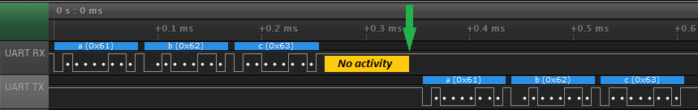

# STM32 UART DMA RX and TX

This application note explains and provides examples for two distinct topics:

- Receiving data via UART and DMA when the application does not now the number of incoming bytes in advance
- Transmitting data via UART and DMA to prevent CPU blocking and allow the CPU to perform other tasks

## Table of Contents

GitHub supports a ToC by default. It is available in the top-right corner of this document.

## Abbreviations

- `DMA`: Direct Memory Access controller in STM32
- `UART`: Universal Asynchronous Receiver Transmitter
- `USART`: Universal Synchronous Asynchronous Receiver Transmitter
- `TX`: Transmit
- `RX`: Receive
- `HT`: Half-Transfer Complete DMA event/flag
- `TC`: Transfer Complete DMA event/flag
- `RTO`: Receiver Timeout UART event/flag
- `IRQ`: Interrupt

## General about UART

> STM32 includes peripherals such as USART, UART, and LPUART. For the purposes of this example, the specific differences between them are not important, since the same concept applies to all of them. In short, USART supports synchronous operation in addition to asynchronous operation (UART), and LPUART supports low-power operation in STOP mode. When synchronous mode or low-power mode is not used, USART, UART, and LPUART can be considered identical. For a complete set of details, refer to the product’s reference manual and data sheet.
> For the purposes of this application note, we will use only the term **UART**.

UART on STM32 can be configured using different  `TX` and  `RX` modes:

`P` = Pro, `C` = Con

- **Polling mode (no DMA, no IRQ)**

  - The application polls status bits to check whether any character has been transmitted or received and must read it quickly enough to avoid missing any bytes
  - `P`: Easy to implement, requiring only a few lines of code
  - `C`: Received data can easily be missed in complex applications if the CPU cannot read the registers quickly enough
  - `C`: Works only for low baud rates, `9600` or lower

- **Interrupt mode (no DMA)**

  - The UART triggers an interrupt, and the CPU jumps to a service routine to handle each received byte separately
  - `P`: A commonly used approach in embedded applications
  * `P`: Works well with common baud rates, `115200` up to `~921600` baud
  * `C`: The interrupt service routine is executed for every received character
  * `C`: System performance may decrease if interrupts are triggered for every character at high baud rates

- **DMA mode**
  
  - DMA transfers data from the USART RX data register to user memory at the hardware level. No application interaction is required at this stage except when processing the received data as needed
  - `P`: Transfer from the USART peripheral to memory is performed at the hardware level without CPU interaction
  - `P`: Can work very easily with operating systems
  - `P`: Optimized for the highest baud rates (`> 1 Mbps`) and low-power applications
  - `P`: For large bursts of data, increasing the data buffer size can improve functionality
  - `C`: The number of bytes to transfer must be known in advance by the DMA hardware
  - `C`: If communication fails, the DMA may not notify the application clearly about all bytes transferred

> This guide focuses exclusively on DMA-based RX operation and explains how to handle cases where the data length is unknown.

Every STM32 includes at least one (`1`) UART IP and at least one (`1`) DMA controller as part of its architecture.  
This is all that is required for successful data transmission.  
The application uses the default features to implement a very efficient DMA-based transmit system.

While implementation is fairly straightforward for TX operations (set a pointer to the data, define its length, and start), this is not necessarily the case for reception.  
When implementing DMA reception, the application must know the number of bytes that the DMA should receive before the transfer is considered *complete*. However, the UART protocol does not provide this information (it could be handled by a higher-level protocol, but that is a separate topic that we do not cover here. We assume a very reliable low-level communication protocol must be implemented).

## Idle Line or Receiver Timeout Events

STM32 UART peripherals can detect when the *RX* line remains inactive for a certain period of time. This can be done using `2` methods:

- *IDLE LINE event*: Triggered when the RX line has been in the idle state (normally high) for `1` frame time after the last received byte. The frame time depends on the baud rate. A higher baud rate means a shorter frame time for a single byte.
- *RTO (Receiver Timeout) event*: Triggered when the line has been in the idle state for a programmable period of time. It is fully configured by firmware.

Both events can trigger an interrupt, which is an essential feature for enabling efficient receive operation.

> Not all STM32 devices support the *IDLE LINE* or *RTO* features. If these features are not available, the related examples cannot be used.

Example: To transmit `1` byte at `115200` baud, it takes approximately (for easier estimation) `~100 µs`; transmitting `3 bytes` would therefore take about `~300 µs` in total. The IDLE line event triggers an interrupt when the line has been in the idle state for `1` frame time (in this case `100 µs`) after the third byte has been received.



This is a real experimental demonstration using *STM32F4* and the *IDLE LINE* event. After the *IDLE event* is triggered, the data is echoed back (loopback mode):

- The application receives `3` bytes, which takes approximately `~300 µs` at `115200` baud
- *RX* goes to the high state (yellow rectangle), and *UART RX* detects that it has been idle for at least `1` frame time (approximately `100 µs`)
  - The width of the yellow rectangle represents `1` frame time
- The *IDLE line* interrupt is triggered at the green arrow
- The application echoes the data back from the interrupt context

## General Information About DMA

DMA in STM32 can be configured in `normal` or `circular` mode. For each mode, *DMA* requires the number of *elements* to transfer before its events (half-transfer complete, transfer complete) are triggered.

- *Normal mode*: DMA starts the data transfer, and once all elements are transferred, it stops and sets the enable bit to `0`.
  - The application uses this mode when transmitting data
- *Circular mode*: DMA starts the transfer, and once all elements are transferred (as specified in the corresponding length register), it starts again from the beginning of memory and continues transferring more data
  - The application uses this mode when receiving data

While the transfer is active, `2` (among others) interrupts may be triggered:

- *Half-Transfer complete `HT`*: Triggered when DMA transfers half of the configured elements
- *Transfer-Complete `TC`*: Triggered when DMA transfers all configured elements

> When DMA operates in *circular* mode, these interrupts are triggered periodically.
> The number of elements to transfer by the DMA hardware must be written to the relevant DMA register before starting the transfer.

### Combine UART + DMA for Data Reception

Now it is time to understand which features should be used to receive data with UART and DMA in order to offload the CPU. For this example, we use a memory buffer array of `20` bytes. DMA will transfer the data received from UART to this buffer.

The steps to begin are listed below. The initial assumption is that UART has already been initialized before reaching this step, and that the basic DMA setup has also been completed.

- The application writes `20` to the relevant DMA register for the data length
- The application writes the memory and peripheral addresses to the relevant DMA registers
- The application sets the DMA direction to *peripheral-to-memory* mode
- The application sets DMA to *circular* mode. This ensures that DMA does not stop transferring data after it reaches the end of memory. Instead, it wraps around and continues transferring additional data from UART to memory
- The application enables DMA and UART in reception mode. Reception cannot start immediately; DMA waits for the UART to receive the first character and then transfers it to the array. This process repeats for every received byte
- The application is notified by the DMA `HT` event (or interrupt) after the first `10` bytes have been transferred from UART to memory
- The application is notified by the DMA `TC` event (or interrupt) after `20` bytes have been transferred from UART to memory
- The application is notified by the UART IDLE line event (or RTO) if an IDLE condition or timeout is detected on the RX line
- The application must handle all of these events for the most efficient receive operation

> This configuration is important because the data length is not known in advance. The application must assume that an unlimited number of bytes may be received; therefore, DMA must operate continuously.
> For demonstration purposes, we used a `20`-byte array. In a real application, this size may need to be increased. It depends on the UART baud rate (higher speeds allow more data to be received within a fixed time window) and on how quickly the application can process the received data (using interrupt notifications, an RTOS, or polling).

### Combine UART + DMA for Data Transmission

Everything becomes simpler when the application transmits data because the length of the data is known in advance and the memory to transmit is already prepared. For this example, we use memory containing the `HelloWorld` message. In *C*, it would look like this:

```C
const char hello_world_arr[] = "HelloWorld";
```

- The application writes the number of bytes to transmit to the relevant DMA register, which would be `strlen(hello_world_arr)` or `10`
- The application writes the memory and peripheral addresses to the relevant DMA registers
- The application sets the DMA direction to *memory-to-peripheral* mode
- The application sets DMA to *normal* mode. This effectively disables DMA once all bytes have been successfully transferred
- The application enables DMA and UART in transmitter mode. Transmission starts immediately when the UART requests the first byte via DMA to be moved to the UART TX register
- The application is notified by the `TC` event (or interrupt) after all bytes have been transferred from memory to UART via DMA
- DMA stops, and the application can immediately prepare the next transfer

> Note that the `TC` event is triggered before the last UART byte has been fully transmitted over UART.
> This is because the `TC` event is part of DMA, not UART.
> It is triggered when DMA transfers all bytes from point *A* to point *B*. In this case, point *A* for DMA is memory, and point *B* is the UART data register.
> After that, it is up to the UART to clock the byte out to the GPIO pin.

### DMA HT/TC and UART IDLE Combination Details

This section describes `4` possible cases and one additional case that explains why both *HT* and *TC* events are necessary in the application.


**Abbreviations used in the image:**

- `R`: Read pointer, used by the application to read data from memory. Later also referred to as `old_ptr`
- `W`: Write pointer, used by DMA to write the next byte. It is incremented every time DMA writes a new byte. Later also referred to as `new_ptr`
- `HT`: Half-Transfer Complete event triggered by DMA
- `TC`: Transfer-Complete event triggered by DMA
- `I`: IDLE line event triggered by USART

**DMA configuration:**

- Circular mode
- `20` bytes data length
  - Consequently, the `HT` event is triggered after `10` bytes are transferred
  - Consequently, the `TC` event is triggered after `20` bytes are transferred

**Possible cases during real-world operation:**

- **Case *A***: DMA transfers `10` bytes. The application receives a notification through the `HT` event and can process the received data.
- **Case *B***: DMA transfers the next `10` bytes. The application receives a notification through the `TC` event. Processing now starts from the last known position until the end of memory.
  - DMA operates in circular mode, so it continues from the beginning of the buffer (shown at the top of the image).

- **Case *C***: DMA transfers `10` bytes, but the transfer is not aligned with either `HT` or `TC` events.
  - The application receives an `HT` event when the first `6` bytes are transferred. Processing can start from the last known read location.
  - The application receives an `IDLE` line event after the next `4` bytes are successfully transferred to memory.
- **Case *D***: DMA transfers `10` bytes in *overflow* mode, but the transfer is not aligned with either `HT` or `TC` events.
  - The application receives a notification through the `TC` event when the first `4` bytes are transferred. Processing can start from the last known read location.
  - The application receives a notification through the `IDLE` event after the next `6` bytes are transferred. Processing can start from the beginning of the buffer.
- **Case *E***: Example of what may happen when the application relies only on the `IDLE` event.
  - If the application receives `30` bytes in a burst, `10` bytes may be overwritten by DMA because the application did not process the data quickly enough.
  - The application receives the `IDLE` line event once the RX line remains steady for `1` byte time.
  - The red portion of the data represents the first `10` received bytes from the burst, which were overwritten by the last `10` bytes in the burst.
  - One way to avoid this scenario is to poll for DMA changes more frequently than the time required to receive a burst of `20` bytes, or to use the `TC` and `HT` events.

Example code to read data from memory and process it for cases *A–D*.

```C
/**
 * \brief           Check for new data received with DMA
 *
 * The user must select the context from which to call this function:
 * - Interrupt context only (DMA HT, DMA TC, UART IDLE) with the same preemption priority level
 * - Thread context only (outside interrupts)
 *
 * If it is called from both contexts, exclusive access protection must be implemented.
 * This mode is not recommended, as it usually indicates architectural design problems.
 *
 * When the IDLE interrupt is not available, the application must rely only on the thread context
 * by manually calling this function as frequently as possible to ensure that
 * data is read from the raw buffer and processed.
 *
 * If reads are not performed quickly enough, DMA may overwrite unread received bytes,
 * causing the application to lose useful data.
 *
 * Possible solutions:
 * - Improve the architecture to allow faster reads
 * - Increase the raw buffer size so DMA can write more data before this function is called
 */
void usart_rx_check(void) {
    /*
     * Set the old position variable as static.
     *
     * The linker should (with the default C configuration) initialize this variable to `0`.
     * It is used to keep the most recent read start position,
     * which makes this function non-reentrant and not thread-safe.
     */
    static size_t old_pos;
    size_t pos;

    /* Calculate the current position in the buffer and check for new data */
    pos = ARRAY_LEN(usart_rx_dma_buffer) - LL_DMA_GetDataLength(DMA1, LL_DMA_CHANNEL_5);
    if (pos != old_pos) {                       /* Check for changes in received data */
        if (pos > old_pos) {                    /* Current position is ahead of the previous one */
            /*
             * Processing is done in "linear" mode.
             *
             * Application processing is fast with a single data block.
             * The length is calculated simply by subtracting the pointers.
             *
             * [   0   ]
             * [   1   ] <- old_pos |------------------------------------|
             * [   2   ]            |                                    |
             * [   3   ]            | Single block (len = pos - old_pos) |
             * [   4   ]            |                                    |
             * [   5   ]            |------------------------------------|
             * [   6   ] <- pos
             * [   7   ]
             * [ N - 1 ]
             */
            usart_process_data(&usart_rx_dma_buffer[old_pos], pos - old_pos);
        } else {
            /*
             * Processing is done in "overflow" mode.
             *
             * The application must process the data twice,
             * because there are two linear memory blocks to handle.
             *
             * [   0   ]            |---------------------------------|
             * [   1   ]            | Second block (len = pos)        |
             * [   2   ]            |---------------------------------|
             * [   3   ] <- pos
             * [   4   ] <- old_pos |---------------------------------|
             * [   5   ]            |                                 |
             * [   6   ]            | First block (len = N - old_pos) |
             * [   7   ]            |                                 |
             * [ N - 1 ]            |---------------------------------|
             */
            usart_process_data(&usart_rx_dma_buffer[old_pos], ARRAY_LEN(usart_rx_dma_buffer) - old_pos);
            if (pos > 0) {
                usart_process_data(&usart_rx_dma_buffer[0], pos);
            }
        }
        old_pos = pos;                          /* Save the current position for the next transfer */
    }
}
```

### Interrupt priorities are important

Thanks to Cortex-M NVIC's (Nested Vectored Interrupt Controller) flexibility,
user can configure priority level for each of the NVIC interrupt lines; it has full control over execution profile for each of the interrupt lines separately.

There are `2` priority types in Cortex-M:
- Preemption priority: Interrupt with higher logical priority level can preempt already running lower priority interrupt
- Subpriority: Interrupt with higher subpriority (but same preemption priority) will execute first when `2` (or more) interrupt lines become active at the same time; such interrupt will also never stop currently executed interrupt (if any) by the CPU.

STM32s have different interrupt lines (interrupt service routines later too) for DMA and UART, one for each peripheral and its priority could be software configurable.

Function that gets called to process received data must keep position of *last read value*, hence processing function is not thread-safe or reentrant and requires special attention.

> The application must assure, DMA and UART interrupts utilize same preemption priority level.
> This is the only configuration to guarantee processing function never gets preempted by itself (DMA interrupt to preempty UART, or opposite), otherwise last-known read position may get corrupted and application will operate with wrong data.

# Examples

Examples can be used as reference code to implement your own DMA TX and RX functionality.

There are 2 sets of examples:
- Examples for RX only
    - Available in `projects` folder with `usart_rx_` prefix
    - DMA is used to receive data, polling is used to echo data back
- Examples for RX & TX
    - DMA is used to receive data and to transmit data back
    - It uses ring buffer to copy data from DMA buffer to application before it is sent back

Common for all examples:
- Developed in [STM32CubeIDE](https://www.st.com/en/development-tools/stm32cubeide.html) for easier evaluation on STM32 boards
- Fully developed using LL drivers for various STM32 families
- UART common configuration: `115200` bauds, `1` stop bit, no-parity
- DMA RX common configuration: Circular mode, `TC` and `HT` events enabled
- DMA TX common configuration: Normal mode, `TC` event enabled
- All RX examples implement loop-back functionality. Every character received by UART and transfered by DMA is sent back to same UART

| STM32 family | Board name         | USART     | STM32 TX | STM32 RX | RX DMA settings                    | TX DMA settings                   |
| ------------ | ------------------ | --------- | -------- | -------- | ---------------------------------- | --------------------------------- |
| STM32F1xx    | `BluePill-F103C8`  | `USART1`  | `PA9`    | `PA10`   | *`DMA1`, `Channel 5`*              |                                   |
| STM32F4xx    | `NUCLEO-F413ZH`    | `USART3`  | `PD8`    | `PD9`    | *`DMA1`, `Stream 1`, `Channel 4`*  | *`DMA1`, `Stream 3`, `Channel 4`* |
| STM32G0xx    | `NUCLEO-G071RB`    | `USART2`  | `PA2`    | `PA3`    | *`DMA1`, `Channel 1`*              |                                   |
| STM32G4xx    | `NUCLEO-G474RE`    | `LPUART1` | `PA2`    | `PA3`    | *`DMA1`, `Channel 1`*              |                                   |
| STM32L4xx    | `NUCLEO-L432KC`    | `USART2`  | `PA2`    | `PA15`   | *`DMA1`, `Channel 6`, `Request 2`* |                                   |
| STM32H7xx    | `NUCLEO-H743ZI2*`  | `USART3`  | `PD8`    | `PD9`    | *`DMA1`, `Stream 0`*               | *`DMA1`, `Stream 1`*              |
| STM32U5xx    | `NUCLEO-U575ZI-Q*` | `USART1`  | `PA9`    | `PA10`   | *`GPDMA1`, `Channel 0`*            | *`GPDMA1`, `Channel 1`*           |

> * It is possible to run H743 (single-core) examples on dual-core STM32H7 Nucleo boards, NUCLEO-H745 or NUCLEO-H755.
> Special care needs to be taken as dual-core H7 Nucleo boards use DCDC for MCU power hence
> application must check clock configuration in main file and uncomment code to enable SMPS.

Examples demonstrate different use cases for RX only or RX&TX combined.

> Demos part of this repository are all based on Low-Level (LL) drivers to maximize user understanding - how to convert theory into practice.
> Some STM32Cube firmware packages include same example using HAL drivers too. Some of them are (with link to example; list is not exhausted) listed below.
> All examples are identified as *UART_ReceptionToIdle_CircularDMA* - you can search for it in your local Cube firmware repository.
> * [STM32U5 UART_ReceptionToIdle_CircularDMA](https://github.com/STMicroelectronics/STM32CubeU5/tree/main/Projects/NUCLEO-U575ZI-Q/Examples/UART/UART_ReceptionToIdle_CircularDMA)
> * [STM32L5 UART_ReceptionToIdle_CircularDMA](https://github.com/STMicroelectronics/STM32CubeL5/tree/master/Projects/NUCLEO-L552ZE-Q/Examples/UART/UART_ReceptionToIdle_CircularDMA)
> * [STM32G4 UART_ReceptionToIdle_CircularDMA](https://github.com/STMicroelectronics/STM32CubeG4/tree/master/Projects/NUCLEO-G474RE/Examples/UART/UART_ReceptionToIdle_CircularDMA)
> * [STM32F4 UART_ReceptionToIdle_CircularDMA](https://github.com/STMicroelectronics/STM32CubeF4/tree/master/Projects/STM32446E-Nucleo/Examples/UART/UART_ReceptionToIdle_CircularDMA)
> * [STM32G0 UART_ReceptionToIdle_CircularDMA](https://github.com/STMicroelectronics/STM32CubeG0/tree/master/Projects/STM32G0C1E-EV/Examples/UART/UART_ReceptionToIdle_CircularDMA)
> * [STM32L4 UART_ReceptionToIdle_CircularDMA](https://github.com/STMicroelectronics/STM32CubeL4/tree/master/Projects/NUCLEO-L476RG/Examples/UART/UART_ReceptionToIdle_CircularDMA)
> * [STM32WB UART_ReceptionToIdle_CircularDMA](https://github.com/STMicroelectronics/STM32CubeWB/tree/master/Projects/P-NUCLEO-WB55.Nucleo/Examples/UART/UART_ReceptionToIdle_CircularDMA)
> * [STM32WL UART_ReceptionToIdle_CircularDMA](https://github.com/STMicroelectronics/STM32CubeWL/tree/main/Projects/NUCLEO-WL55JC/Examples/UART/UART_ReceptionToIdle_CircularDMA)

## Examples for UART + DMA RX

### Polling for changes

- DMA hardware takes care to transfer received data to memory
- The application must constantly poll for new changes in DMA registers and read received data quick enough to make sure DMA will not overwrite data in buffer
- Processing of received data is in thread mode (not in interrupt)
- P: Easy to implement
- P: No interrupts, no consideration of priority and race conditions
- P: Fits for devices without *USART IDLE* line detection
- C: Application takes care of data periodically
- C: Not possible to put application to low-power mode (sleep mode)

### Polling for changes with operating system

- Same as polling for changes but with dedicated thread in operating system to process data
- P: Easy to implement to RTOS systems, uses single thread without additional RTOS features (no mutexes, semaphores, memory queues)
- P: No interrupts, no consideration of priority and race conditions
- P: Data processing always *on-time* with maximum delay given by thread delay, thus with known maximum latency between received character and processed time
    - Unless system has higher priority threads
- P: Fits for devices without *UART IDLE* line detection
- C: Application takes care of data periodically
- C: Uses memory resources dedicated for separate thread for data processing
- C: Not possible to put application to low-power mode (sleep mode)

### UART IDLE line detection + DMA HT&TC interrupts

- The application receives a notification by IDLE line detection or DMA TC/HT events
- Application has to process data only when it receives any of the `3` interrupts
- P: Application does not need to poll for new changes
- P: The application receives interrupts on events
- P: Application may enter low-power modes to increase battery life (if operated on battery)
- C: Data are read (processed) in the interrupt. We strive to execute interrupt routine as fast as possible
- C: Long interrupt execution may break other compatibility in the application

*Processing of incoming data is from 2 interrupt vectors, hence it is important that they do not preempt each-other. Set both to the same preemption priority!*

### USART Idle line detection + DMA HT&TC interrupts with RTOS

- The application receives a notification by IDLE line detection or DMA TC/HT events
- The application uses separate thread to process the data only when notified in one of interrupts
- P: Processing is not in the interrupt but in separate thread
- P: Interrupt only informs processing thread to process (or to wakeup)
- P: Operating system may put processing thread to blocked state while waiting for event
- C: Memory usage for separate thread + message queue (or semaphore)

> This is the most preferred way to use and process UART received character

## Examples for UART DMA for TX (and optionally included RX)

- Application is using DMA in normal mode to transfer data
- Application is always using ringbuffer between high-level write and low-level transmit operation
- DMA TC interrupt is triggered when transfer has finished. Application can then send more data

### Demo application for debug messages

This is a demo application available in `projects` folder.
Its purpose is to show how the application can implement output of debug messages without drastically affect CPU performance.
It is using DMA to transfer data (no CPU to wait for UART flags) and can achieve very high or very low data rates

- All debug messages from application are written to intermediate ringbuffer
- Application will try to start & configure DMA after every successfive write to ringbuffer
- If transfer is on-going, next start is configured from DMA TC interrupt

As a result of this demo application for STM32F413-Nucleo board, observations are as following:
- Demo code sends `1581` bytes every second at `115200` bauds, which is approx `142ms`.
- With DMA disabled, CPU load was `14%`, in-line with time to transmit the data
- With DMA enabled, CPU load was `0%`
- DMA can be enabled/disabled with `USE_DMA_TX` macro configuration in `main.c`

## How to use this repository

1. Run `git clone --recurse-submodules https://github.com/MaJerle/stm32-usart-dma-rx-tx` to clone repository including submodules
2. Run examples from `projects` directory using [STM32CubeIDE IDE](https://www.st.com/en/development-tools/stm32cubeide.html)
